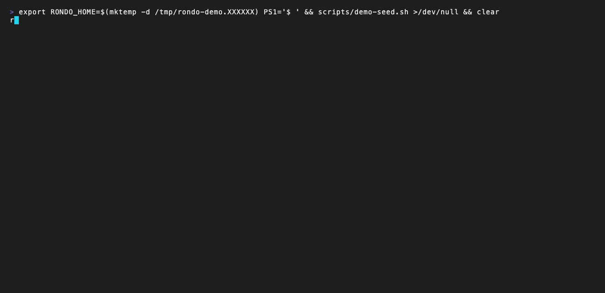
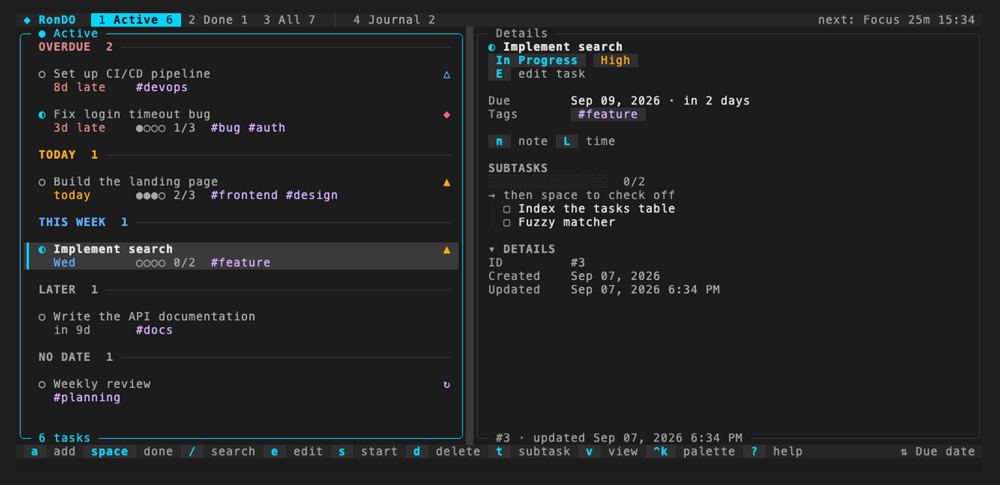
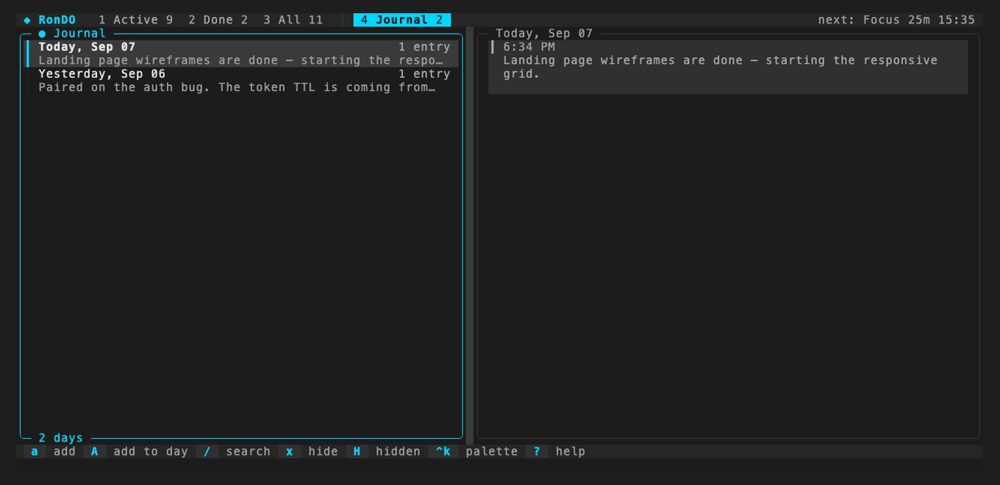

# RonDO · OpenTUI + React

[](https://github.com/roniel-rhack/rondo-opentui/actions/workflows/ci.yml)
[](https://github.com/roniel-rhack/rondo-opentui/releases)
[](LICENSE)

Terminal productivity app — tasks, journal and pomodoro — rebuilt on
[OpenTUI](https://github.com/anomalyco/opentui) + React + Bun, ported from the
original Go/Bubbletea [rondo](https://github.com/roniel-rhack/rondo).

Same data, same CLI, new interface: real mouse support, layered overlays,
flexbox layout, a command palette, live filtering and an installable skill so
AI coding agents can drive it too.

<p align="center">
  
</p>

<p align="center">
  
</p>
<p align="center"><em>Metadata grid per row, subtask meters, notes and time logs in the detail panel</em></p>

<p align="center">
  
</p>
<p align="center"><em>One note per day, timestamped entries, smart date labels</em></p>

## Install

```bash
brew install roniel-rhack/tap/rondo-opentui
```

Or grab a binary from the [releases page](https://github.com/roniel-rhack/rondo-opentui/releases)
(macOS arm64/x64, Linux arm64/x64) — it is a single self-contained file:

```bash
tar xzf rondo-opentui-darwin-arm64.tar.gz
./rondo-opentui
```

The binary is called `rondo-opentui` so it can live next to the Go build. Alias
it if you prefer the short name:

```bash
alias rondo=rondo-opentui
```

## Quick start

```bash
rondo-opentui                                  # the TUI
rondo-opentui add "Write the report" --due +3d --priority high --tags work
rondo-opentui list                             # any argument runs the CLI instead
rondo-opentui skill install                    # let Claude Code manage your tasks
```

Data lives in `~/.todo-app/todo.db`. Set `RONDO_HOME` to use another
directory — handy for a throwaway profile:

```bash
RONDO_HOME=$(mktemp -d) rondo-opentui
```

## TUI

Everything is reachable with both keyboard and mouse; `?` opens the full key
map in-app. The keys you will use most:

| Key | Action |
|-----|--------|
| `a` / `e` | Add / edit a task (quick-add tokens work in the title, see below) |
| `space` | Mark done / reopen |
| `+` `-` `@` `#` | Priority up / down, due date, tag picker |
| `d` then `u` | Delete, undo — every edit is undoable |
| `/` | Filter: free text, `#tag`, `!high`, `due:today`, `is:blocked` |
| `v` | Cycle view: all → today → overdue → week → blocked |
| `ctrl+k` | Command palette over every action and task |
| `1` `2` `3` `4` | Active / Done / All / Journal |
| `f` | Start / stop a focus session |
| `?` | Help |

<details>
<summary><strong>Full key map</strong></summary>

**Global**

| Key | Action |
|-----|--------|
| `?` | This help |
| `ctrl+k` | Command palette (tasks and actions, fuzzy) |
| `1` `2` `3` `4` | Active / Done / All / Journal |
| `tab` `shift+tab` | Next / previous tab |
| `u` | Undo (status, edit, delete — everything is undoable) |
| `R` | Reload from disk (also polled automatically) |
| `T` | Light / dark theme |
| `P` | Focus (pomodoro) settings |
| `S` | Statistics |
| `f` | Start / stop focus |
| `z` | Density (auto / dense / comfortable) |
| `<` `>`, drag | Resize panels |
| `y` / `n` | Confirm / cancel a dialog |
| `q`, `ctrl+c` | Quit (asks while focus runs) |

**Navigation**

| Key | Action |
|-----|--------|
| `j` `k` `↑` `↓` | Move selection |
| `g` `G`, `Home` `End` | First / last |
| `PgUp` `PgDn`, `ctrl+u` `ctrl+d` | Page up / down |
| `h` `l` `←` `→` | Switch panel |
| `enter` | Open detail / edit the row under the cursor |
| `esc` | Back out one step: marks, detail, query + tag, view |

**Tasks**

| Key | Action |
|-----|--------|
| `a` / `e` | Add / edit |
| `space` | Mark done / reopen |
| `s` | Start / stop |
| `d` | Delete — undo with `u` (confirms only if it blocks another task) |
| `+` `-` | Priority up / down |
| `@` | Due date (`t` `m` `w` `n` chips, or a typed date) |
| `#` | Tag picker |
| `[` `]` | Previous / next tag |
| `t` `n` `L` | Add subtask / note / time log |
| `b` `B` | Block on… / remove blocker… |
| `m` | Mark for a bulk action, then `space`/`+`/`-`/`@`/`d` apply to all |
| `o`, `F1` `F2` `F3` | Cycle sort / by created / due / priority |
| `v` | Cycle view: all → today → overdue → week → blocked |
| `/` | Filter: free text, `#tag`, `!high`, `due:today`, `is:blocked` |

**Detail panel**

| Key | Action |
|-----|--------|
| `space` | Toggle subtask |
| `enter`, `e` | Edit the subtask, note or log under the cursor |
| `d` | Delete row |
| `t` `n` `L` | Add subtask / note / log |
| `h`, `esc` | Back to list |

**Journal**

| Key | Action |
|-----|--------|
| `a` | Add entry to today |
| `A` | Add entry to the selected day |
| `e` / `d` | Edit / delete the selected entry |
| `x` / `H` | Hide a note / show hidden notes |
| `/` | Search entries |

</details>

Quick-add tokens work in the title field of `a`/`e` — `#tag` (repeatable),
`@today` / `@tomorrow` / `@+3d` / `@+1w` / `@2026-09-01`, `!low` / `!med` /
`!high` / `!urgent` (or `!1`–`!4`), `~d` / `~w` / `~m` / `~y` for recurrence —
stripped from the stored title and previewed live as you type.

Inside dialogs: `tab` / `shift+tab` move between fields, `←` / `→` pick a
segmented option, `ctrl+s` saves (multiline fields keep `enter` for new
lines), `esc` cancels.

Mouse: click tabs, rows, tags and status glyphs, double-click a row to edit
it, drag the divider to resize the panels, scroll with the wheel.

### Session and live data

The TUI remembers the tab, sort order, tag filter, view, selected row and
density across restarts in `~/.todo-app/tui-state.json`. It also polls the
database for changes made from another terminal — the CLI, an agent running
the skill, or a second `rondo-opentui` — and reloads with a toast when
something else committed; `R` reloads on demand.

### Running next to the Go build

Both builds share `~/.todo-app/todo.db` and `config.json`, and can run at the
same time. Two TS-only pieces survive that:

- `config set theme dark|light|auto` stores a `theme` key the Go build ignores
  and drops when it rewrites `config.json` — harmless, just re-set it.
- The TUI session lives in its own `tui-state.json`, which the Go build never
  reads or touches.

### Design

- **One palette, semantic tokens.** Every component reads colors from
  `src/tui/theme.ts` (surfaces, borders, accent, semantic states), so light and
  dark stay consistent and a re-theme is a single file.
- **Density with hierarchy.** A priority rail runs down both lines of a row so
  it reads as one block and doubles as the selection cursor. The second line is
  a fixed grid — due date, four-dot progress, tags — so the eye scans columns
  instead of ragged text. Completed tasks collapse to a single muted line.
- **Calm color.** Overdue rows carry a compact `!` marker in a softened red;
  the loud `OVERDUE` badge is reserved for the detail panel. Tags are capped at
  two plus a `+n` counter, so no row ever wraps.
- **Motion where it means something.** Meters ease towards their new value,
  overlays fade their backdrop in, and toasts carry a hairline timer that drains
  as they expire — the status bar keeps a reserved row so nothing jumps.
- **Real inputs.** Titles use a single-line input, descriptions and journal
  entries a true multiline textarea, priority and recurrence a clickable
  segmented control, due dates a text field plus `today / tomorrow / +1w / none`
  shortcuts.
- **Feedback everywhere.** Hover states on rows, tabs, chips, palette entries
  and buttons; focused panels get an accent border and a `●` marker; the filter
  bar shows `matches/total` and turns red when nothing matches. An edited row
  glows for a moment, so a change reads where it landed and not only in the
  toast.
- **Explained ranking.** The letters a filter or palette query matched light
  up in every row, so a fuzzy hit is never a mystery; a whole-word hit beats a
  scattered one and an early hit beats a late one.
- **Sections that read as bands.** Group headers take the tone of what they
  hold — overdue in red, today in amber — and run a hairline to the panel
  edge. The task a focus session is attached to carries a `▶` in the list and
  a `FOCUSING` chip in its detail, so the header timer and the list agree.
- **Journal at a glance.** Each day in the journal previews the opening words
  of its first entry under the date, markdown stripped.

### What changed versus the Go TUI

| Go (Bubbletea) | This port |
|---|---|
| Manual width/height arithmetic | Yoga flexbox layout |
| Panel borders drawn character by character | `<box border>` with title/subtitle |
| Dialogs replaced the whole screen | Real overlays with a fading backdrop |
| Single-line inputs everywhere | Textarea for prose, segmented controls, date shortcuts |
| No mouse | Click, hover, drag-to-resize, wheel scroll |
| Filtering through the list widget | Live fuzzy filter with match count |
| Static rendering | Eased meters, fading overlays, draining toast timer |
| — | Command palette (`ctrl+k`) over every action, tasks included |
| — | Responsive single-column layout on narrow terminals |
| — | Runtime light/dark switch |
| One-shot status cycling, deletes need a confirm | Every edit and delete is one key, undoable with `u` |
| Sort only | Views (today / overdue / week / blocked), tag picker, marks for bulk edits |
| Nothing survives a restart | Tab, sort, tag, view and selection restored from `tui-state.json` |
| Reads the database once | Polls for changes made by the CLI or another session and reloads |

## CLI

A faithful port — same commands, flags, exit codes and JSON shapes as the Go
build — plus a few additions: `block` / `unblock`, `version`, `skill`,
`config set theme`, relative due dates and JSON output on mutations.

```bash
rondo-opentui add "Write the report" --priority high --due 2026-03-15 --tags work
rondo-opentui add "Call back" --due tomorrow          # today, yesterday, +Nd, +Nw
rondo-opentui list --status active --sort priority --json
rondo-opentui show 1
rondo-opentui edit 1 --title "New title" --clear-due
rondo-opentui done 1 2
rondo-opentui delete 3 --force --cascade
rondo-opentui status 1 active
rondo-opentui block 2 1                               # 2 waits for 1
rondo-opentui unblock 2 1

rondo-opentui subtask add 1 "Collect numbers"
rondo-opentui note add 1 "Talked to design"
rondo-opentui timelog add 1 1h30m --note "deep work"
rondo-opentui recur set 1 weekly

rondo-opentui journal "Shipped the port"
rondo-opentui journal list --json
rondo-opentui journal show yesterday

rondo-opentui focus start --duration 25m
rondo-opentui stats --json
rondo-opentui export --format md --journal --output report.md
rondo-opentui config set date_format european
rondo-opentui config set theme light                  # dark, light or auto
echo '{"cmd":"add","args":["From batch"]}' | rondo-opentui batch
rondo-opentui completion zsh
rondo-opentui version
```

Global flags: `--json`, `--format table|json|plain`, `--quiet`/`-q`,
`--no-color`. Color is disabled automatically when stdout is not a terminal.
Exit codes: `0` ok, `1` error, `3` not found.

## AI agents

The CLI is built to be driven by an agent, and it ships the skill that teaches
one how:

```bash
rondo-opentui skill install                   # Claude Code: ~/.claude/skills/rondo-opentui/
rondo-opentui skill install --provider codex  # OpenAI Codex: ~/.agents/skills/
rondo-opentui skill install --project         # into ./.claude/skills/ of the current repo
rondo-opentui skill status                    # where it is installed, and whether it is current
```

What makes it agent-safe:

- `--json` on every command: reads return data, mutations return the affected
  object, so `add --json` hands back the new id.
- Destructive commands never prompt when stdin is not a TTY — they fail and
  ask for `--force` instead of hanging.
- `done` is idempotent, so a retried call never spawns a recurring task twice.
- `batch` takes one JSON command per line on stdin for bulk work.
- `RONDO_HOME` sandboxes everything to a throwaway directory.

The reasoning behind the CLI surface is in [`docs/cli-review.md`](docs/cli-review.md).

## Develop

Requires [Bun](https://bun.sh) ≥ 1.4.

```bash
bun install

bun run start          # launch the TUI
bun run dev            # TUI with hot reload
bun run start list     # any argument dispatches to the CLI instead
bun test               # core, CLI and live TUI rendering (~1 min)
bun run typecheck      # tsc --noEmit
bun run build          # single binary at dist/rondo-opentui
```

Never point a dev build at your real database:

```bash
RONDO_HOME=$(mktemp -d) bun run start
```

`src/core/` is the domain and persistence layer (no UI imports), `src/cli/`
the Cobra-style command tree, `src/tui/` the OpenTUI + React interface;
[`CLAUDE.md`](CLAUDE.md) has the full layout, the compatibility rules shared
with the Go build and the OpenTUI gotchas worth knowing before touching the
TUI. The design history lives in [`docs/`](docs/): three TUI review passes and
one CLI review, each opening with its resolution status and the deviations
taken from the original fix notes.

Tests run against in-memory SQLite; the TUI ones render through OpenTUI's test
renderer with simulated keyboard and mouse input and assert on the frame text.

### Demo

The recording is generated with [VHS](https://github.com/charmbracelet/vhs) from
a seeded throwaway profile, so it never touches your own database:

```bash
bun run build
PATH="$PWD/dist:$PATH" vhs assets/demo.tape
```

`scripts/demo-seed.sh` fills `$RONDO_HOME` with sample tasks, subtasks, notes,
time logs and journal entries, with due dates relative to today.

### Releases

Tagging `vX.Y.Z` builds standalone binaries for macOS (arm64/x64) and Linux
(arm64/x64) on native runners, publishes them with `checksums-sha256.txt`, and
asks [roniel-rhack/homebrew-tap](https://github.com/roniel-rhack/homebrew-tap)
to refresh `Formula/rondo-opentui.rb`.

```bash
git tag vX.Y.Z && git push origin vX.Y.Z
```

The tap update needs a `HOMEBREW_TAP_TOKEN` repository secret with `repo`
scope on the tap. Without it the release still publishes and the formula can be
refreshed by hand:

```bash
gh workflow run update-rondo-opentui.yml -R roniel-rhack/homebrew-tap -f version=X.Y.Z
```

## License

[MIT](LICENSE)
